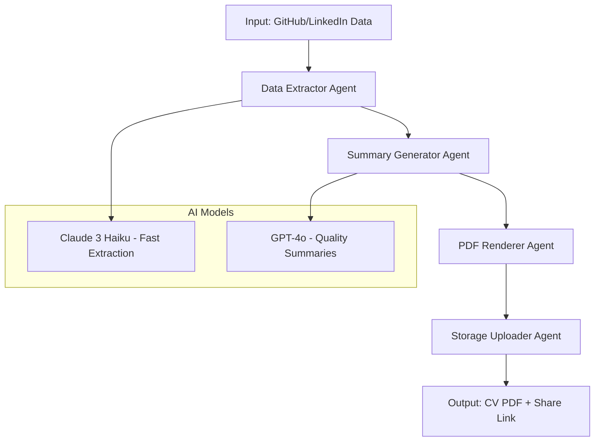

# AI Agents Architecture

## Overview

Borg-Tools MVP uses LangGraph for orchestrating AI agents that transform GitHub/LinkedIn data into professional CVs. The system follows a multi-agent pipeline with specialized responsibilities.

## Architecture Flow



## Agent Definitions

### 1. Data Extractor Agent (`claude-extractor/`)

**Purpose**: Extract and structure data from GitHub repositories and LinkedIn profiles

**Model**: Claude 3 Haiku (cost-optimized for high-volume processing)

**Inputs**:
- GitHub API data (repositories, commits, languages, stars)
- LinkedIn profile HTML/JSON
- User preferences and filters

**Outputs**:
```python
@dataclass
class ExtractedData:
    personal_info: PersonalInfo
    technical_skills: List[TechnicalSkill]
    projects: List[Project]
    experience: List[Experience]
    education: List[Education]
    achievements: List[Achievement]
```

**Key Functions**:
- Parse repository metadata and commit history
- Extract programming languages and frameworks
- Identify top projects by activity/stars
- Clean and normalize data formats

### 2. Summary Generator Agent (`gpt-summary/`)

**Purpose**: Generate professional summaries and descriptions

**Model**: GPT-4o (quality-focused for critical content)

**Inputs**:
- Structured data from extractor
- Industry context and job market trends
- User's target role/industry preferences

**Outputs**:
```python
@dataclass
class GeneratedContent:
    professional_summary: str
    project_descriptions: List[str]
    skill_highlights: List[str]
    achievement_narratives: List[str]
```

**Key Functions**:
- Create compelling professional summaries (80-120 words)
- Generate project descriptions with impact metrics
- Craft achievement narratives with quantified results
- Optimize for ATS (Applicant Tracking Systems)

### 3. LinkedIn Parser Agent (`linkedin-parser/`)

**Purpose**: Extract structured data from LinkedIn profiles

**Model**: Claude 3 Haiku (pattern recognition optimized)

**Inputs**:
- LinkedIn profile URL or exported data
- HTML content or structured JSON

**Outputs**:
```python
@dataclass
class LinkedInData:
    profile_info: ProfileInfo
    work_experience: List[WorkExperience]
    education_history: List[Education]
    certifications: List[Certification]
    recommendations: List[Recommendation]
```

**Key Functions**:
- Parse complex LinkedIn HTML structures
- Extract work experience with dates and descriptions
- Identify relevant certifications and courses
- Handle privacy restrictions and data limitations

### 4. PDF Renderer Agent (`pdf-renderer/`)

**Purpose**: Generate styled PDF using React-PDF

**Framework**: React-PDF with custom styling

**Inputs**:
- Processed data from previous agents
- Design system configuration
- User customization preferences

**Outputs**:
- Single-page PDF (<200KB)
- "Neon Tech on Black" design theme
- ATS-compatible structure

**Key Functions**:
```jsx
// Core rendering components
const PDFDocument = ({ data, theme }) => (
  <Document>
    <Page size="A4" style={styles.page}>
      <Header profile={data.personal_info} />
      <TechStack skills={data.technical_skills} />
      <Projects projects={data.projects} />
      <Experience experience={data.experience} />
    </Page>
  </Document>
);
```

### 5. Storage Uploader Agent (`storage-uploader/`)

**Purpose**: Handle PDF storage and share link generation

**Storage**: Supabase Storage with security policies

**Inputs**:
- Generated PDF buffer
- User authentication context
- Metadata and analytics tags

**Outputs**:
```python
@dataclass
class StorageResult:
    pdf_url: str
    share_url: str  # 24-hour expiry
    file_size: int
    upload_timestamp: datetime
    analytics_id: str
```

**Key Functions**:
- Upload PDF to Supabase Storage bucket
- Generate secure, time-limited share URLs
- Implement storage quotas and cleanup
- Track usage analytics

## LangGraph State Machine

```python
from langgraph import StateGraph, END

# Define the workflow state
class CVGenerationState(TypedDict):
    user_id: str
    github_data: Optional[Dict]
    linkedin_data: Optional[Dict]
    extracted_data: Optional[ExtractedData]
    generated_content: Optional[GeneratedContent]
    pdf_buffer: Optional[bytes]
    result: Optional[StorageResult]
    errors: List[str]

# Build the graph
workflow = StateGraph(CVGenerationState)

# Add nodes
workflow.add_node("extract_github", extract_github_data)
workflow.add_node("parse_linkedin", parse_linkedin_data)
workflow.add_node("extract_data", claude_extractor_agent)
workflow.add_node("generate_summaries", gpt_summary_agent)
workflow.add_node("render_pdf", pdf_renderer_agent)
workflow.add_node("upload_storage", storage_uploader_agent)

# Define edges and conditions
workflow.add_edge("extract_github", "extract_data")
workflow.add_edge("parse_linkedin", "extract_data")
workflow.add_edge("extract_data", "generate_summaries")
workflow.add_edge("generate_summaries", "render_pdf")
workflow.add_edge("render_pdf", "upload_storage")
workflow.add_edge("upload_storage", END)

# Set entry point
workflow.set_entry_point("extract_github")
```

## Error Handling & Recovery

### Retry Mechanisms
```python
@retry(
    stop=stop_after_attempt(3),
    wait=wait_exponential(multiplier=1, min=4, max=10),
    retry=retry_if_exception_type((APIError, NetworkError))
)
async def agent_with_retry(inputs):
    # Agent implementation
    pass
```

### Fallback Strategies
- **Claude API Down**: Fall back to GPT-3.5-turbo for extraction
- **PDF Generation Fails**: Return structured data as JSON
- **Storage Upload Fails**: Retry with exponential backoff

### Circuit Breaker Pattern
```python
class AgentCircuitBreaker:
    def __init__(self, failure_threshold=5, timeout=60):
        self.failure_count = 0
        self.failure_threshold = failure_threshold
        self.timeout = timeout
        self.last_failure_time = None
        self.state = "CLOSED"  # CLOSED, OPEN, HALF_OPEN
```

## Performance Optimization

### Caching Strategy
- **GitHub Data**: Cache for 1 hour (repositories change infrequently)
- **LinkedIn Data**: Cache for 24 hours (profiles update rarely)
- **Generated Summaries**: Cache for 7 days with content hash

### Parallel Processing
```python
async def parallel_data_extraction(user_data):
    tasks = [
        extract_github_data(user_data.github_url),
        parse_linkedin_data(user_data.linkedin_url),
        fetch_industry_context(user_data.target_role)
    ]
    results = await asyncio.gather(*tasks, return_exceptions=True)
    return handle_parallel_results(results)
```

### Cost Optimization
- **Claude Haiku**: $0.0015/1K tokens input, $0.0075/1K tokens output
- **GPT-4o**: $0.03/1K tokens input, $0.06/1K tokens output
- **Target Cost**: <$0.05 per CV generation

## Monitoring & Observability

### LangFuse Integration
```python
from langfuse.decorators import observe

@observe()
def claude_extractor_agent(state: CVGenerationState):
    # Automatic tracing and token counting
    with langfuse.trace(name="data_extraction") as trace:
        result = anthropic_client.messages.create(...)
        trace.update(
            input=state.github_data,
            output=result,
            metadata={"model": "claude-3-haiku", "cost": calculate_cost(result)}
        )
    return result
```

### Metrics Collection
- **Latency**: P50, P95, P99 response times per agent
- **Cost**: Token usage and API costs per request
- **Quality**: User feedback scores and error rates
- **Throughput**: Requests per minute and concurrent users

### Alerting Rules
```yaml
alerts:
  - name: "High Error Rate"
    condition: "error_rate > 0.05"
    severity: "warning"
  - name: "API Cost Spike"
    condition: "hourly_cost > $10"
    severity: "critical"
  - name: "Slow PDF Generation"
    condition: "pdf_generation_p95 > 30s"
    severity: "warning"
```

## Testing Strategy

### Unit Tests
```python
def test_claude_extractor_agent():
    # Mock GitHub API response
    mock_github_data = load_fixture("github_response.json")
    
    # Test extraction
    result = claude_extractor_agent(mock_github_data)
    
    # Assertions
    assert result.technical_skills
    assert len(result.projects) <= 5
    assert all(project.description for project in result.projects)
```

### Integration Tests
```python
@pytest.mark.integration
async def test_full_cv_generation_pipeline():
    # Test end-to-end workflow
    initial_state = CVGenerationState(
        user_id="test_user",
        github_data=load_fixture("github_data.json")
    )
    
    # Run workflow
    result = await workflow.ainvoke(initial_state)
    
    # Verify final output
    assert result.result.pdf_url
    assert result.result.file_size < 200_000  # <200KB
```

### Load Testing
```python
# Simulate concurrent CV generations
async def load_test_cv_generation():
    tasks = [
        generate_cv(user_id=f"user_{i}")
        for i in range(100)  # 100 concurrent requests
    ]
    results = await asyncio.gather(*tasks)
    
    # Analyze performance
    latencies = [r.latency for r in results]
    assert max(latencies) < 60  # Max 60s
    assert sum(r.cost for r in results) < 5  # Max $5 total
```

## Future Extensions

### Multi-Model Support
```python
class ModelRouter:
    def select_model(self, task_type: str, user_tier: str) -> str:
        if user_tier == "premium":
            return "gpt-4o" if task_type == "summary" else "claude-3-opus"
        return "claude-3-haiku"
```

### Custom Templates
- Industry-specific CV layouts
- Regional formatting preferences
- Company-specific optimizations

### Advanced Features
- **Multi-language Support**: CV generation in 10+ languages
- **ATS Optimization**: Score and improve ATS compatibility
- **Industry Analysis**: Tailor content for specific job markets
- **A/B Testing**: Compare different summary styles

## Security Considerations

### Data Privacy
- All user data encrypted at rest and in transit
- PII scrubbing in logs and traces
- GDPR-compliant data retention (30 days)

### API Security
```python
class RateLimiter:
    def __init__(self, requests_per_minute=10):
        self.requests_per_minute = requests_per_minute
        self.requests = defaultdict(list)
    
    def is_allowed(self, user_id: str) -> bool:
        now = time.time()
        minute_ago = now - 60
        
        # Clean old requests
        self.requests[user_id] = [
            req_time for req_time in self.requests[user_id]
            if req_time > minute_ago
        ]
        
        # Check limit
        if len(self.requests[user_id]) >= self.requests_per_minute:
            return False
        
        self.requests[user_id].append(now)
        return True
```

### Input Validation
```python
from pydantic import BaseModel, validator

class CVGenerationRequest(BaseModel):
    github_url: Optional[str] = None
    linkedin_url: Optional[str] = None
    
    @validator('github_url')
    def validate_github_url(cls, v):
        if v and not v.startswith('https://github.com/'):
            raise ValueError('Invalid GitHub URL')
        return v
```

## Deployment & Scaling

### Container Strategy
```dockerfile
# Multi-stage build for agents
FROM python:3.12-slim as base
RUN pip install langchain langgraph anthropic openai

FROM base as claude-extractor
COPY agents/claude-extractor/ /app/
CMD ["python", "main.py"]

FROM base as gpt-summary
COPY agents/gpt-summary/ /app/
CMD ["python", "main.py"]
```

### Kubernetes Deployment
```yaml
apiVersion: apps/v1
kind: Deployment
metadata:
  name: cv-generation-agents
spec:
  replicas: 3
  selector:
    matchLabels:
      app: cv-agents
  template:
    spec:
      containers:
      - name: agent-pool
        image: borg-tools/agents:latest
        resources:
          requests:
            memory: "512Mi"
            cpu: "500m"
          limits:
            memory: "1Gi"
            cpu: "1000m"
```

### Auto-scaling Configuration
```yaml
apiVersion: autoscaling/v2
kind: HorizontalPodAutoscaler
metadata:
  name: cv-agents-hpa
spec:
  scaleTargetRef:
    apiVersion: apps/v1
    kind: Deployment
    name: cv-generation-agents
  minReplicas: 2
  maxReplicas: 20
  metrics:
  - type: Resource
    resource:
      name: cpu
      target:
        type: Utilization
        averageUtilization: 70
  - type: Resource
    resource:
      name: memory
      target:
        type: Utilization
        averageUtilization: 80
```

This agents architecture provides a robust, scalable foundation for CV generation while maintaining cost efficiency and high quality output.